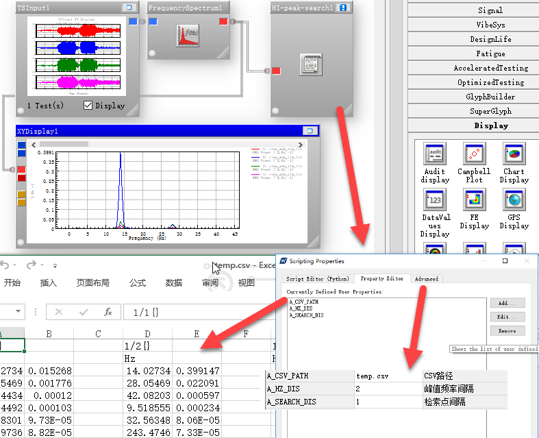

# pyncode
ncode相关子模块
__version : python 2.7__

## 频域计算模块
Histogram 数据
+ hi_ride_cal 
	+ 对平顺性加速度数据转化后的频域PSD谱进行,平顺性计算  

+ hi_peak_search 
	+ 查找频域数据波峰峰值及对应频率
	+ 流程图如下：

## 时域计算模块
TimeSeries 数据
+ ts_fun
	+ 时域计算相关子模块

+ ts_rps_translate 
	+ 首末数据点设置为0
	+ 采样频率微调

+ ts_to_adams_spline
	+ 将 TS 数据转化为 adams spline 生成命令

+ ts_transient_modal
	+ 将 TS 数据作为加载数据，转化成Nastran-bdf文件
	+ 分析:瞬态分析-模态法

+ ts_VI_compare
	+ 等长数据-对比
	+ 用于迭代数据对比评估

