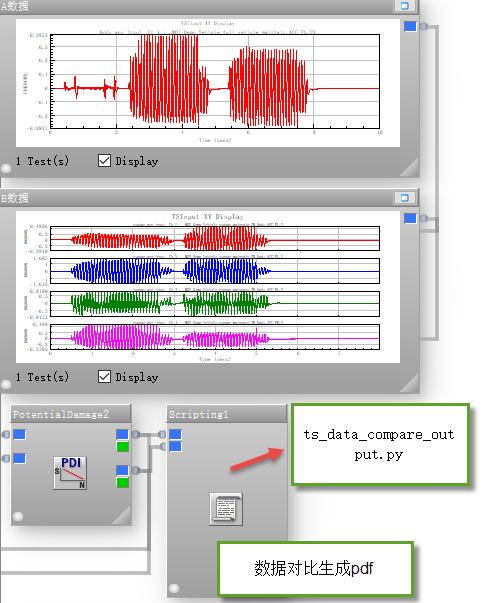
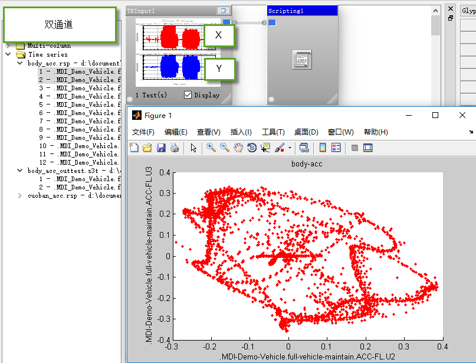

# pyncode
ncode相关子模块
__version : python 2.7__

目录
+ GlyphCollections : Ncode直接调用
+ baidu_GPS_get

## baidu_GPS_get
根据[百度拾取坐标系统](https://api.map.baidu.com/lbsapi/getpoint/index.html) 截取GPS图片
共三部:
+ 鼠标指向, 地图-左上角, enter按键确认
+ 鼠标指向, 地图-右下角, enter按键确认
+ 鼠标指向, 网页内-坐标复制按钮, enter按键确认

## 频域计算模块
Histogram 数据
+ hi_ride_cal 
	+ 对平顺性加速度数据转化后的频域PSD谱进行,平顺性计算  

+ hi_peak_search 
	+ 查找频域数据波峰峰值及对应频率
	+ 流程图如下：

## 时域计算模块
TimeSeries 数据

+ ts_cut_file_pdi
	+ 根据截断数据, 输出截断后的CSV文件, 并进行PDI数据处理

+ ts_fun
	+ 时域计算相关子模块

+ ts_rps_translate 
	+ 首末数据点设置为0
	+ 采样频率微调

+ ts_to_adams_spline
	+ 将 TS 数据转化为 adams spline 生成命令

+ ts_transient_modal
	+ 将 TS 数据作为加载数据，转化成Nastran-bdf文件
	+ 分析:瞬态分析-模态法

+ ts_VI_compare 暂停使用
	+ 等长数据-对比
	+ 用于迭代数据对比评估

## 数据对比模块
+ ts_data_compare_output
	+ ncode模板文件 : PDI数据对比及PDF生成.flo
		+ 调用PDI模块
		+ 调用python接口模块,用于数据处理及pdf文件生成
	+ python模块:
		+ ncode接口 		: ts_data_compare_output.py
		+ 数据处理及pdf 	: data_compare_input_cal.py

+ ts_matlab_plot
	+ matlab代码, matlab与ncode同位数版本(如32位/64位)
	+ 自定义横坐标,散点做图

